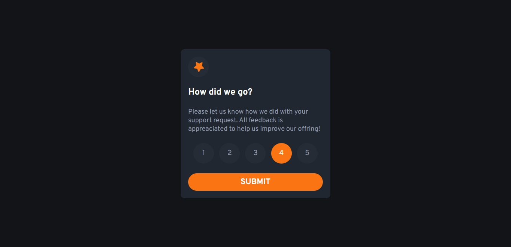

# Frontend Mentor - Interactive rating component

## Welcome! 👋

This is the solution to the challenge of creating an [Interactive Ranking Component, made available by the Frontend Mentor website.](https://www.frontendmentor.io/challenges/interactive-rating-component-koxpeBUmI)

## Table of contents

- [Overview](#overview)
  - [The Challenge](#the-challenge)
  - [screenshot](#screenshot)
  - [Links](#links)
- [My Process](#my-process)
  - [Built With](#built-with)
- [Author](#author)
- [Acknowledgments](#Acknowledgments)

## Overview

### The Challenge

Users should be able to:

- View the optimal layout for the app depending on their device's screen size
- See hover states for all interactive elements on the page
- Select and submit a number rating
- See the "Thank you" card state after submitting a rating

### Screenshot

### Links

- to Solution: [Acess Solution](https://www.frontendmentor.io/solutions/interactive-rating-component-AgykfftKtx)
- to Site on live: [Acess Site](https://luanflorencioo.github.io/interactive-rating)

## My Process

### Built With

- HTML5 Markup Semantics
- Styling preprocessor: SCSS
- Flexbox
- Media Queries
- Mobile-first workflow
- Javascript
- [Sass](https://sass-lang.com/) - Framework CSS

## Author

_Luan Florêncio_

- GitHub - [LuanFlorencioo](https://github.com/LuanFlorencioo)
- Frontend Mentor - [@LuanFlorencioo](https://www.frontendmentor.io/profile/LuanFlorencioo)
- Twitter - [@LuanF_dev](https://www.twitter.com/LuanF_dev)

## Acknowledgments

I would like to thank my cousin [Eduardo](https://github.com/Edufreitass) for providing the best "coding" friendship on the face of the world. He must be reading this and laughing right now.
