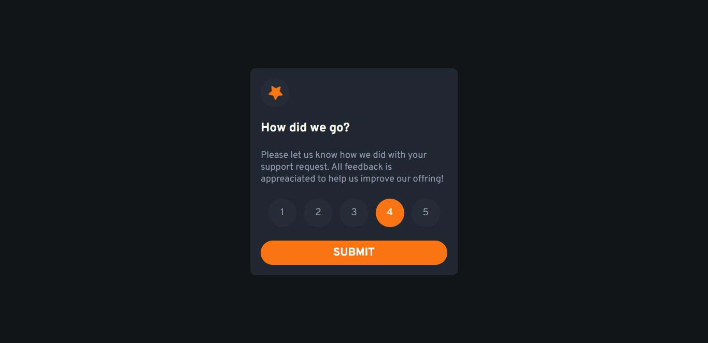
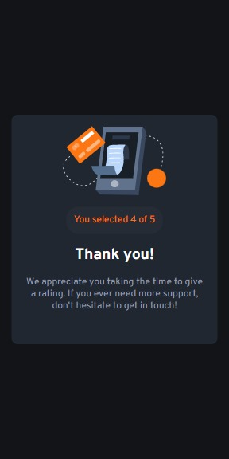
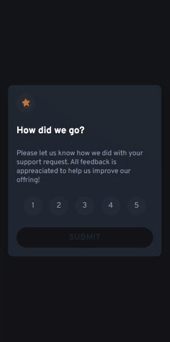

# Frontend Mentor - Interactive rating component solution

Esta é a solução para o desafio de criar um [Componente de classificação interativo, disponibilizado pelo site Frontend Mentor.](https://www.frontendmentor.io/challenges/interactive-rating-component-koxpeBUmI)

## Índices

- [Visão Geral](#visao-geral)
  - [O Desafio](#o-desafio)
  - [screenshot](#screenshot)
  - [Links](#links)
- [Progesso](#progesso)
  - [Ferramentas](#ferramentas)
- [Autor](#autor)
- [Agradecimentos](#agradecimentos)

## Visão Geral

### O Desafio

Os usuários devem ser capazes de:

- Visualizar o layout ideal para o aplicativo, dependendo do tamanho da tela do dispositivo.
- Vê os estados de foco para todos os elementos interativos na página.
- Selecionar e enviar uma classificação numérica.
- Ver o estado do componente "Obrigado" após enviar uma avaliação.

### Screenshot

### Links

- Link para Solução: [Acessar Solução](https://www.frontendmentor.io/solutions/interactive-rating-component-AgykfftKtx)
- Link para conferir o Site ao vivo: [Acessar site](https://luanflorencioo.github.io/interactive-rating)

## Progresso

### Ferramentas

- Semântica HTML5 de marcação
- Pré-processador de estilização: SCSS
- Flexbox
- Media Queries
- Mobile-first workflow
- Javascript
- [Sass](https://sass-lang.com/) - Framework CSS

## Autor

_Luan Florêncio_

- GitHub - [LuanFlorencioo](https://github.com/LuanFlorencioo)
- Frontend Mentor - [@LuanFlorencioo](https://www.frontendmentor.io/profile/LuanFlorencioo)
- Twitter - [@LuanF_dev](https://www.twitter.com/LuanF_dev)

## Agradecimentos

Gostaria de agradecer ao meu primo [Eduardo](https://github.com/Edufreitass) por proporcionar a melhor amizade de "codagem" na face do mundo. Ele deve está lendo isto e rindo agora.